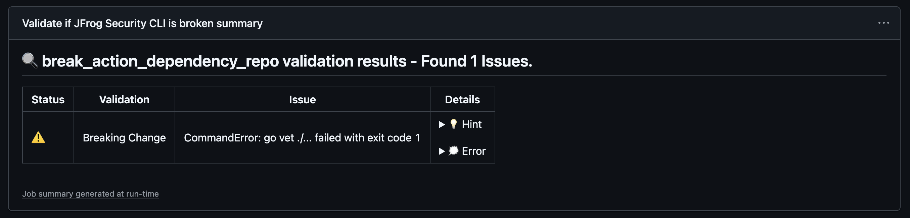
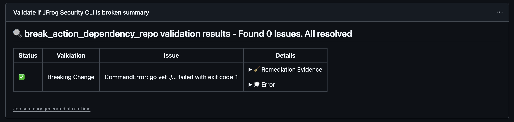

<div align="center">

# Breaking-Change-Validator 

</div>

Managing multiple repositories that depend on each other can be challenging, especially when changes in one repository break the functionality of another. This is even more difficult when these repositories are maintained by different teams or individuals.

Breaking-Change-Validator is a GitHub Action designed to address this issue. It validates whether changes in a branch break a dependent library that relies on its interfaces. By integrating this action into your workflow, you can catch breaking changes early in the development process, reducing the risk of discovering issues late in the release cycle or, worse, after deployment.

This action is particularly useful for teams working on interconnected projects, ensuring seamless collaboration and maintaining the integrity of dependent libraries.

### Supported Technologies

|          |                                               |
|----------|-----------------------------------------------|
| GoLang   |  |

## 🏗️ Usage

To use this action in your GitHub workflow, add the following step to your workflow file:
```yml
- uses: attiasas/breaking-change-validator@v1
  with:
    repository: <REPOSITORY_CLONE_URL>
```

> Replace `<REPOSITORY_CLONE_URL>` with the clone URL of the repository you want to validate against.

<details>
<summary>Full Workflow Template (e.g. .github/workflows/change-validator.yml)</summary>

```yaml
name: Validate breaking depended libraries

on:
  push:
    branches:
      - '**'
    tags-ignore:
      - '**'
  pull_request:
    types: [labeled, unlabeled, opened, edited]  # Run when labels change or PR events occur
  workflow_dispatch:

# Ensures that only the latest commit is running for each PR at a time.
concurrency:
  group: ${{ github.workflow }}-${{ github.event.pull_request.number || github.sha }}-${{ github.ref }}
  cancel-in-progress: true

permissions:
  # required for the action to create comments on the PR
  pull-requests: write

jobs:
  validate-depended-libraries:
    name: "Validate if ${{ matrix.library.name }} is broken"
    runs-on: ubuntu-latest
    strategy:
      fail-fast: false
      matrix:
        library:
          - name: 'Go Library'
            url: '<REPOSITORY_CLONE_URL>'
            branch: 'dev'
            test_command: 'go test -v -race ./...'
    steps:
      - uses: actions/checkout@v4
        with:
          ref: ${{ github.event.pull_request.head.sha }}

      - uses: attiasas/breaking-change-validator@v1
        env:
          # Optional, needed for some action operations (generating PR comments)
          GITHUB_TOKEN: ${{ secrets.GITHUB_TOKEN }}
        with:
          repository: ${{ matrix.library.url }}
          branch: ${{ matrix.library.branch }}
          output_strategy: 'terminal, summary, comment'
          # Run dependency tests only if label exists at the PR or running on a normal branch
          test_command: ${{ github.event_name != 'pull_request' && matrix.library.test_command || (contains(github.event.pull_request.labels.*.name, 'integration tests') && matrix.library.test_command) || '' }}
          remediation_label: 'validated'

```

</details>


### Inputs

| Name                | Description                                                                                                              | Required | Default            |
|---------------------|--------------------------------------------------------------------------------------------------------------------------|----------|--------------------|
| `repository`        | The clone URL of the dependent repository to validate.                                                                   | Yes      | None               |
| `branch`            | The branch of the dependent repository to validate.                                                                      | No       | Default Ref        |
| `output_strategy`   | Determines where validation results will be shown: `terminal`, `summary`, or `comment`. Comma-separated values allowed.  | No       | `terminal,summary` |
| `install_command`   | Optional shell command to run at the target repository to prepare it for validation.                                     | No       | None               |
| `test_command`      | Optional shell command to run at the target repository with the changes.                                                 | No       | None               |
| `remediation_label` | If provided and the label exists on the pull request, issues will be considered resolved and the check will pass.        | No       | None               |

## 💬 Output 

The action reports the results in a generated [Job Summary](https://github.blog/news-insights/product-news/supercharging-github-actions-with-job-summaries/)





### PR Comment generation

If the action runs on a related PR, you can optionally configure the action to generate a comment on it if issues are detected and not resolved.

#### Preconditions

`GITHUB_TOKEN` environment variable - GitHub token with `pull-requests: write` permission.

You can utilize [$\{{secrets.GITHUB\_TOKEN\}}](https://docs.github.com/en/actions/security-guides/automatic-token-authentication), which is an automatically generated token by GitHub.

## 🧪 Issue Remediation

### Remediation Label
In order to resolve the issues raised by the action you can specify the `remediation_label` input.
If provided, the action will check if the related pull request is labeled with this value and mark the issues as resolved.

#### Preconditions

Make sure to add the related pull request types to capture when labels are changed.
```yaml
on:
  pull_request:
    types: [labeled, unlabeled, opened, edited]  # Run when labels change or PR events occur
```

## 🫱🏻‍🫲🏼 Contributions

We welcome contributions from the community! If you'd like to help us improve this project, please follow these steps:

1. Fork the repository.
2. Create a new branch for your feature or bug fix.
3. Make your changes and ensure all tests pass.
4. Submit a pull request with a clear description of your changes.

For more details, please read our [Contribution Guidelines](./CONTRIBUTING.md#-guidelines).